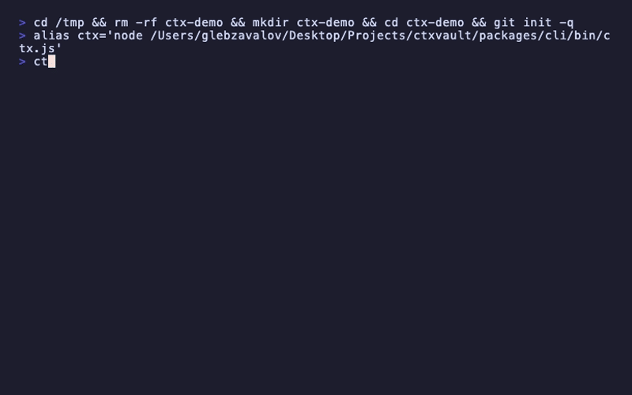

<p align="center">
  
</p>

<h1 align="center">CtxVault</h1>

<p align="center">
  <strong>Your AI agents have amnesia. CtxVault is the cure.</strong>
</p>

<p align="center">
  Persistent, intelligent memory for AI coding agents.<br/>
  Git-native &bull; SQLite + FTS5 &bull; Works with Claude Code, Cursor, Codex, Windsurf
</p>

<p align="center">
  <a href="https://www.npmjs.com/package/ctxvault"></a>
  <a href="https://github.com/Old-G/ctxvault/actions"></a>
  <a href="LICENSE"></a>
  <a href="https://nodejs.org"></a>
</p>

---

## The Problem

Every time an AI agent starts a new session, it forgets everything:
- The gotcha that took 2 hours to debug
- The architecture decision you explained three times
- The convention your team agreed on yesterday

**CtxVault** stores project knowledge as Markdown files in `.ctx/`, indexed via SQLite FTS5, and automatically injects relevant context into every agent session.

## Demo

<!-- Replace with actual recording: https://asciinema.org or https://github.com/faressoft/terminalizer -->
<p align="center">
  
</p>

<details>
<summary>Text version of the demo</summary>

```bash
$ ctx init
  Created .ctx/ with default config
  Detected: claude-code
  Installed 5 hooks in .claude/settings.json
  Generated skill in .agents/skills/ctxvault/

$ ctx add gotcha "React useEffect runs twice in dev mode"
  Saved: .ctx/gotchas/react-useeffect-runs-twice-in-dev-mode.md

$ ctx search "useEffect"
  [0.92] gotcha — React useEffect runs twice in dev mode
         .ctx/gotchas/react-useeffect-runs-twice-in-dev-mode.md

$ ctx status
  Memories: 1 (gotcha: 1)
  Index: vault.db (FTS5, 1 entries)
  Config: .ctx/config.yaml

$ ctx inject
  <context name="project-memory">
  ## gotcha — React useEffect runs twice in dev mode
  StrictMode in React 18+ intentionally double-invokes effects...
  </context>
```

</details>

## Quick Start

```bash
# Install globally
npm install -g ctxvault

# Initialize in your project
cd your-project
ctx init

# That's it. Your AI agent now has persistent memory.
```

### What `ctx init` does

1. Creates `.ctx/` directory with subdirectories for each memory type
2. Detects your AI agent (Claude Code, Cursor, etc.)
3. Installs hooks for automatic context injection
4. Generates an Agent Skill for intelligent memory management
5. Initializes SQLite FTS5 index for fast search

## How It Works

```
┌─────────────────────────────────────────────────────┐
│                    AI Agent Session                   │
├─────────────────────────────────────────────────────┤
│                                                       │
│  SessionStart ──► ctx inject (relevant memories)      │
│                                                       │
│  PreToolUse ────► ctx context-for-file (file gotchas) │
│                                                       │
│  Working... ────► Agent uses skill to save/search     │
│                                                       │
│  PreCompact ───► ctx snapshot (save session state)    │
│                                                       │
│  Stop ──────────► ctx auto-extract (find patterns)    │
│                                                       │
└─────────────────────────────────────────────────────┘
```

### Three Integration Layers

| Layer | How | Latency | Purpose |
|-------|-----|---------|---------|
| **Hooks** | Automatic, deterministic | <10ms | Inject context, track changes, extract patterns |
| **Skill** | Agent-driven, intelligent | ~100ms | Save memories, search knowledge, reflect |
| **Plugin** | Slash commands + sub-agents | ~200ms | `/ctxvault:search`, `/ctxvault:reflect` |

## Memory Types

| Type | When to Save | Example |
|------|-------------|---------|
| `gotcha` | Surprising/counterintuitive behavior | "SQLite WAL mode requires shared-memory access" |
| `decision` | Architecture or technology choice | "Chose FTS5 over Elasticsearch for simplicity" |
| `solution` | Problem diagnosed and solved | "Fixed memory leak by closing DB connections" |
| `discovery` | New knowledge about the codebase | "Config loader supports hot-reload via file watcher" |
| `convention` | Coding standard or pattern | "All API responses use camelCase keys" |

## CLI Commands

### Core

```bash
ctx init                    # Initialize vault in current project
ctx status                  # Show vault status
ctx doctor                  # Diagnose configuration issues
ctx connect                 # Detect and configure AI agents
```

### Memory Management

```bash
ctx add <type> <summary>    # Add a memory interactively
ctx save --type T --summary S --content C  # Save (for scripts)
ctx show <path>             # View full memory content
ctx edit <path>             # Edit in $EDITOR
ctx remove <path>           # Delete a memory
ctx list [--type T]         # List memories
ctx search <query>          # FTS5 full-text search
ctx inject                  # Preview injection payload
```

### Intelligence

```bash
ctx decay [--dry-run]       # Apply relevance decay
ctx deprecate <path>        # Lower relevance of outdated memory
ctx reflect [--dry-run]     # Analyze sessions, extract new memories
ctx defrag [--dry-run]      # Merge duplicates, archive stale entries
ctx import --agent claude-code [--limit N]  # Import from session history
```

### Hooks (called automatically by agents)

```bash
ctx hook session-start      # Inject context at session start
ctx hook context-for-file   # Contextual gotchas for specific files
ctx hook track-change       # Track file access patterns
ctx hook snapshot           # Save session state before compaction
ctx hook auto-extract       # Extract patterns from completed sessions
```

## Configuration

`.ctx/config.yaml`:

```yaml
version: 1

injection:
  enabled: true
  max_tokens: 500          # Token budget for session-start injection
  always_include_system: true

contextual:
  enabled: true
  max_tokens: 200          # Token budget for per-file context

extract:
  enabled: true
  mode: lightweight        # or 'deep' (requires ANTHROPIC_API_KEY)

decay:
  enabled: true
  lambda: 0.01             # Exponential decay rate
  archive_threshold: 0.2
  delete_threshold: 0.05

git:
  auto_commit: true
  commit_prefix: "ctx:"
```

## Deep Extract Mode

For LLM-powered extraction (optional):

```bash
export ANTHROPIC_API_KEY=sk-ant-...
```

Update `.ctx/config.yaml`:

```yaml
extract:
  mode: deep  # Uses Claude Haiku for intelligent pattern extraction
```

## Using Without the CLI (Skill-Only Mode)

All skill scripts work without `ctx` installed — they auto-detect and fall back to `grep`/`find`/`cat`:

```bash
# These work even without npm install -g ctxvault
bash .agents/skills/ctxvault/scripts/inject.sh
bash .agents/skills/ctxvault/scripts/search.sh "auth"
bash .agents/skills/ctxvault/scripts/save.sh gotcha "summary" "content"
bash .agents/skills/ctxvault/scripts/list.sh
bash .agents/skills/ctxvault/scripts/read.sh .ctx/gotchas/example.md
```

## Architecture

```
ctxvault-monorepo/
├── packages/
│   ├── core/          # @ctxvault/core — library
│   │   ├── config/    # YAML config loader + Zod validation
│   │   ├── memory/    # MemoryStore (Markdown + frontmatter)
│   │   ├── index/     # SQLite + FTS5 + Drizzle ORM
│   │   ├── injection/ # Token budgeting (js-tiktoken)
│   │   ├── extraction/# Pattern detection + dedup + deep extract
│   │   ├── intelligence/ # Decay, reflect, defrag
│   │   ├── import/    # Claude Code JSONL transcript parser
│   │   └── git/       # Auto-commit, gitignore management
│   ├── cli/           # ctxvault — CLI (Commander.js + chalk)
│   └── plugin/        # Claude Code Plugin (commands, hooks, agents)
```

## Storage Format

Memories are plain Markdown with YAML frontmatter — readable, diffable, reviewable in PRs:

```markdown
---
type: gotcha
summary: React useEffect runs twice in dev mode
created: 2026-02-20T12:00:00Z
relevance: 0.8
tags: [react, hooks, dev-mode]
related_files: [src/components/App.tsx]
---

StrictMode in React 18+ intentionally double-invokes effects
in development to help find bugs. This is expected behavior
and does not happen in production builds.
```

Indexed in SQLite FTS5 for instant full-text search with BM25 ranking.

## Performance

| Operation | Latency |
|-----------|---------|
| FTS5 Search | ~0.1ms |
| PreToolUse (context-for-file) | ~0.05ms |
| SessionStart (inject) | ~2.4ms |
| Full rebuild index | ~50ms (100 memories) |

## Requirements

- Node.js >= 22
- Git (for auto-commit features)

## Contributing

```bash
git clone https://github.com/Old-G/ctxvault.git
cd ctxvault
pnpm install
pnpm build
pnpm test        # 40 tests
pnpm typecheck
pnpm lint
```

## License

[MIT](LICENSE)
